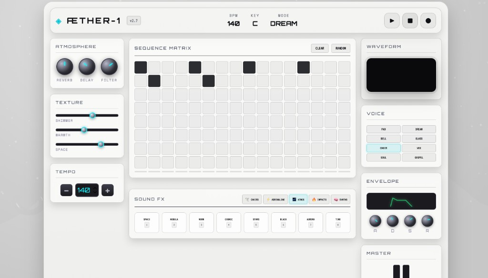

## ÆTHER-1 — Retro Futuristic Ethereal Beat Maker

This is an experiment with Cursor to make music beats.

### What it does

- Retro-device style UI for an ethereal beat maker
- 8×16 step sequencer + transport controls
- Web Audio synth voices + ethereal / Kanye-inspired sound FX
- Three.js ambient background visuals

### Screenshot

